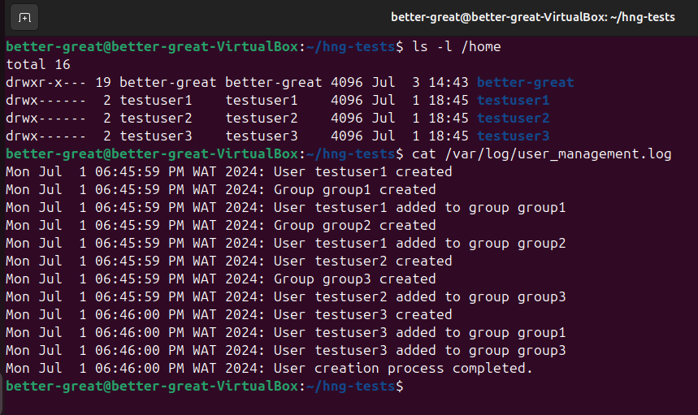
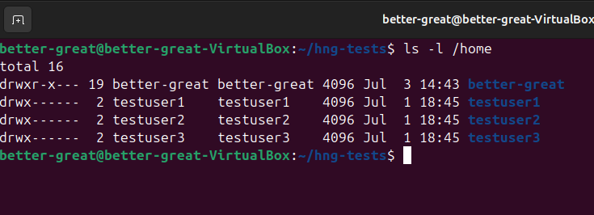

# User Management Automation Script

This bash script automates the process of creating users and groups based on an input file. It was developed as part of the HNG Internship program. You can learn more about the program at [HNG Internship](https://hng.tech/internship) and [HNG Premium](https://hng.tech/premium).

This bash script automates the process of creating users and groups in Linux systems. It reads user information from an input file, creates users with secure passwords, assigns them to groups, and logs all actions. Developed to streamline system administration tasks, this script ensures efficient and secure user onboarding.

## Features
The script aims to:

1. Read a text file containing `usernames` and `groups`.
2. Create users and their corresponding personal groups.
3. Assign users to specified additional groups.
4. Set up home directories with appropriate permissions.
5. Generate random passwords for the users.
6. Log all actions to `/var/log/user_management.log`.
7. Store generated passwords securely in a separate file.
8. Checks for and handles common errors.

## Prerequisites

- Linux environment (tested on Ubuntu)
- Root or sudo access
- `openssl` for password generation

## How the Script Works
This bash script, `create_users.sh`, is designed to create users and groups based on an input file.

1. Prepare an input file (e.g., test_users.txt) with the format:
```
cd touch test_users.txt

#Input the text below within the file created
testuser1;group1,group2
testuser2;group3
testuser3;group1,group3
```

2. Create the script and make it executable:
```
chmod +x create_users.sh
```

3. To test run the script and confirm it is working as expected, do so by using root privileges:
```
sudo ./create_users.sh test_users.txt
```

### Script Explanation
**Header**  
This line specifies the script interpreter.
```
#!/bin/bash
```

**Script Description and Usage**  
These comments describe the script and how to use it.
```
# Script: create_users.sh
# Description: Creates users and groups based on input file
# Usage: ./create_users.sh INPUT_FILE
```

**Input File Validation**  
The script starts by checking if an input file was provided and if it exists. This ensures proper usage and prevents errors.
```
if [ $# -ne 1 ]; then
    echo "Error: Please provide an input file."
    echo "Usage: $0 INPUT_FILE"
    exit 1
fi

if [ ! -f "$1" ]; then
    echo "Error: Input file '$1' does not exist."
    exit 1
fi
```

**Directory Setup**  
The script creates necessary directories for logging and password storage, ensuring proper permissions.
```
mkdir -p "$(dirname "$LOG_FILE")"
mkdir -p "$(dirname "$PASSWORD_FILE")"
mkdir -p /var/secure
chmod 700 /var/secure
```

**Utility Functions**  
Two key functions are defined:

1. `generate_password()`: Creates a secure random password using `openssl`.
2. `log_message()`: Logs actions with timestamps.

```
generate_password() {
    openssl rand -base64 12
}

log_message() {
    echo "$(date): $1" >> "$LOG_FILE"
}
```

**User Creation Function**  
The `create_user()` function handles:

- User creation with home directory
- Password generation and assignment
- Personal group creation
- Additional group assignments
- Home directory permission setting

```
create_user() {
    local username=$1
    local groups=$2

    # User creation logic here
    # ...
}
```

**Main Execution Loop**  
The script reads the input file line by line, processes each user, and calls the `create_user()` function.
```
while IFS=';' read -r username groups || [ -n "$username" ]; do
    username=$(echo "$username" | tr -d '[:space:]')
    groups=$(echo "$groups" | tr -d '[:space:]')
    [ -z "$username" ] && continue
    create_user "$username" "$groups"
done < "$INPUT_FILE"
```

**File Locations**

- Log file: `/var/log/user_management.log`
- Password file: `/var/secure/user_passwords.csv`

**Security Measures**

- Passwords are generated using openssl for randomness
- The password file is stored in a secure directory (`/var/secure`) with restricted permissions `(700)`
- User home directories are created with 700 permissions
- Personal groups are created for each user for better access control

**Error Handling**
The script includes error checks for:

- Invalid input file
- User creation failures
- Group creation and assignment failures
- Each action is logged, including errors, for easy troubleshooting

**Logging**  
All actions are logged to `/var/log/user_management.log`, including:

- User creation
- Group creation and assignments
- Any errors encountered


**Testing**
To test the script:

- Create a test input file with sample users and groups
- Run the script with this file
- Check the log file and password file
- Verify user and group creation using system commands (`getent passwd`, `getent group`)
- Attempt to log in as a new user
  
